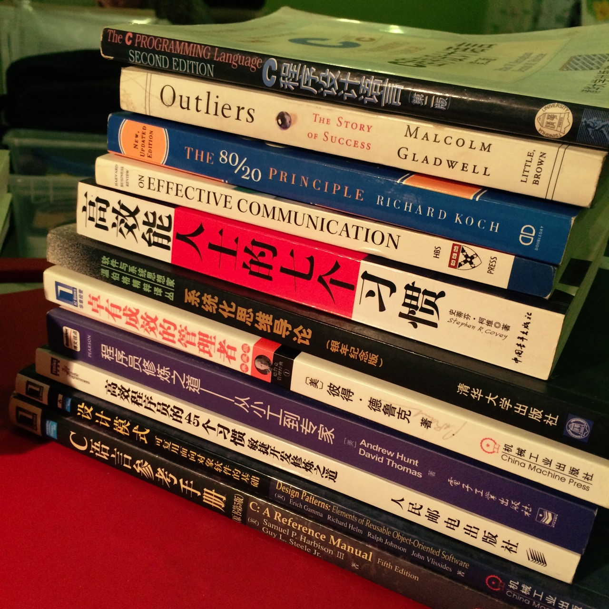

## Communication

- Face to Face
- 电话
- IM (WeChat, QQ, Mingdao, Slack, ...)
- 邮件
- 重要的事情当面/电话/IM沟通，事后邮件存档
- 邮件To/Cc/Bcc
- 邮件标题/内容

## Self Study and Improvement

- 不懂就问 (**Dont be shy!**)
- 相关性
  - 与当前工作内容密切相关的
  - 横向相关
  - 纵向深化
  - eg, International language -> Unicode -> UTF8 -> iconv
- 系统性
- 经典书籍
- 思想、思维方式和方法比具体的知识点更重要
- 10000小时定律 (Outlier)

## Efficiency

- 避免重复
- 重复的事情脚本化/工具化
- 学习掌握一门脚本语言 (bash, makefile, python, ...)
- 熟练掌握一个文本编辑器
  - Vim
  - Emacs
  - Sublime
  - Atom
  - VS Code
  - Notepad++
  - UltraEdit

## Notes

- 好记性不如烂笔头
- Notebook (手写本)
- 3M PostIt!
- OneNote
- EverNote
- 有道云笔记
- iCloud
- 多设备共享同步
- 定期整理 -> Knowledge Base

## Troubleshooting / Problem Solving

- 多问几个为什么
- 与其他人多交流
- 不懂就问，虚心求教
- Brainstorm
- 系统化思维
- 复杂问题分解成小问题各个击破
- 对比
- 分清主次和轻重缓急
- 用最简单最笨的方法做事 (KISS - Keep It Simple, Stupid)
- 办法总比问题多

## Time Management

- 欲求快先求对
- 目标
- 计划
- 日程表
  - Mingdao
  - Google Calendar
  - Apple Calendar
  - ...
- 团队日程表
  - Meeting Request
  - 预约别人的时间
- 任务管理
  - 天
  - 半天
  - 2 Hours
  - Half an Hour
- 80/20 Rule

## Version Control / Working Management System

- 把日常工作纳入管理系统
- 源代码/文档版本管理
  - Git
  - SVN
- Bug Management System
- Task Management System
- Requirement Management System

## Project

- Target
- Plan
- Schedule
- Status
- Severity vs Priority
- 及时报告问题和状态
- 团队合作
- 大局观

## Tools

- Editor
- Shell
  - Cygwin
- Calendar
- Notes
- Sharing
- Documentation
  - Markdown
  - Dot
  - Graphviz
  - PlantUML
  - Draw.io
  - yEd
  - Lucidchart Diagrams
  - OmniGraffle
- Mind Map
  - XMind
- OA (Office Automation)
- GTD (Getting Things Done)
  - Alfred

## Books

## 
End

